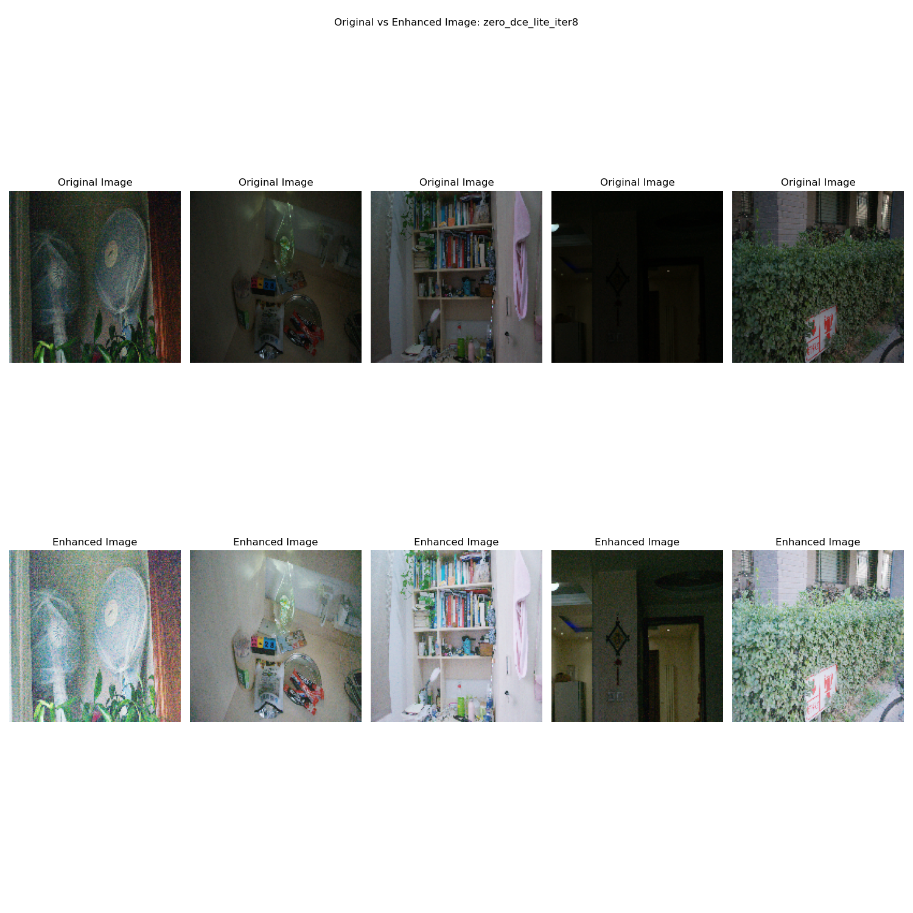
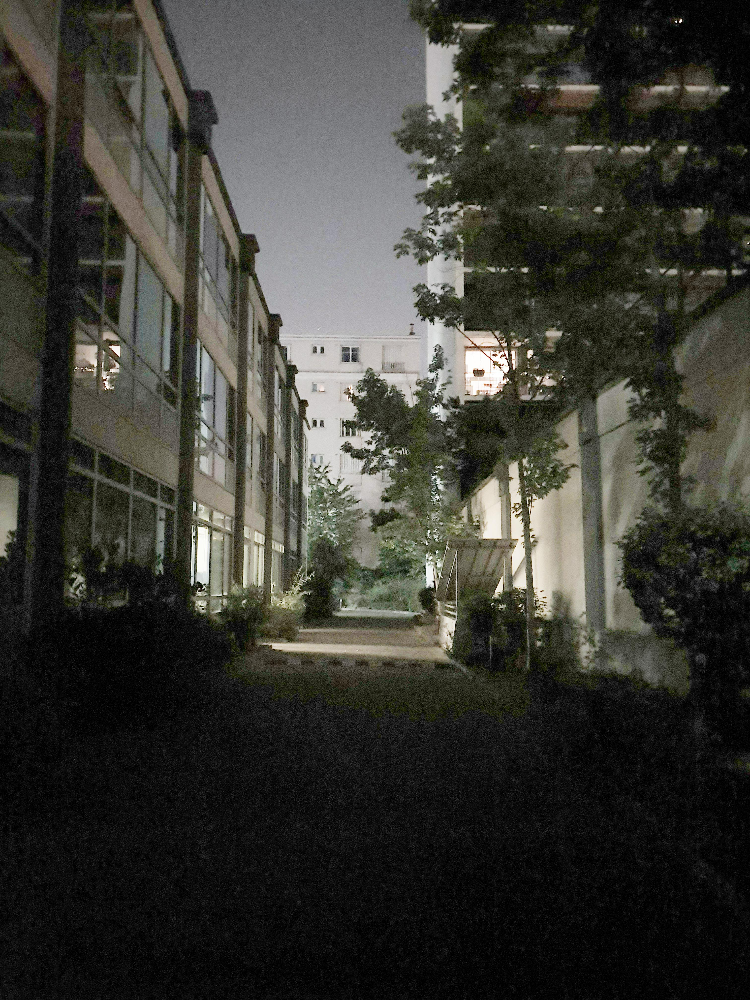
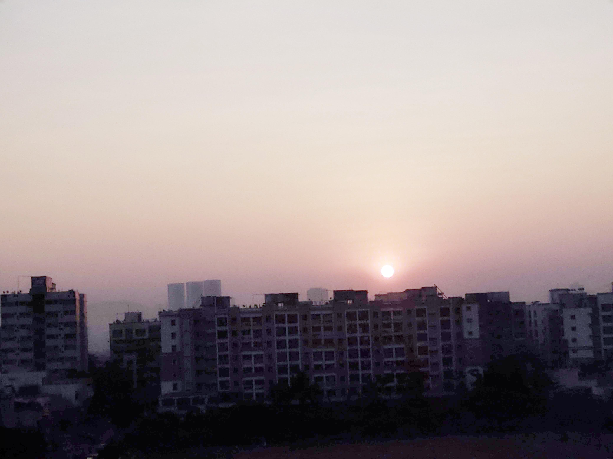

# Zero-DCE and Zero-DCE++(Lite architechture for Mobile and edge Devices) [](https://twitter.com/intent/tweet?text=checkout%20this%20implementation%20of%20Zero-DCE:&url=https%3A%2F%2Fgithub.com%2FThehunk1206%2FZero-DCE)
[](https://tensorflow.org)
[](https://keras.io/)
[](https://www.python.org/)

[](https://paperswithcode.com/sota/low-light-image-enhancement-on-dicm?p=zero-reference-deep-curve-estimation-for-low)
[](https://paperswithcode.com/sota/low-light-image-enhancement-on-lime?p=zero-reference-deep-curve-estimation-for-low)
[](https://paperswithcode.com/sota/low-light-image-enhancement-on-mef?p=zero-reference-deep-curve-estimation-for-low)
[](https://paperswithcode.com/sota/low-light-image-enhancement-on-npe?p=zero-reference-deep-curve-estimation-for-low)
[](https://paperswithcode.com/sota/low-light-image-enhancement-on-vv?p=zero-reference-deep-curve-estimation-for-low)

[](LICENSE)
[](https://github.com/Thehunk1206/Zero-DCE/stargazers)
[](https://github.com/Thehunk1206/Zero-DCE/network/members)
[](https://github.com/Thehunk1206/Zero-DCE/watchers)

[](https://github.com/Thehunk1206/)
[](https://www.linkedin.com/in/tauhid-khan-24bb45177/)

[](mailto:mail2tauhidkhan@gmail.com)


## Papers Abstract
```
The paper presents a novel method, Zero-Reference Deep Curve Estimation (Zero-DCE), which formulates 
light enhancement as a task of image-specific curve estimation with a deep network. 
Our method trains a lightweight deep network, DCE-Net, to estimate pixel-wise and 
high-order curves for dynamic range adjustment of a given image. The curve estimation 
is specially designed, considering pixel value range, monotonicity, and differentiability. 
Zero-DCE is appealing in its relaxed assumption on reference images, i.e., it does not 
require any paired or unpaired data during training. This is achieved through a set of 
carefully formulated non-reference loss functions, which implicitly measure the 
enhancement quality and drive the learning of the network. Our method is efficient 
as image enhancement can be achieved by an intuitive and simple nonlinear curve mapping. 
Despite its simplicity, we show that it generalizes well to diverse lighting conditions. 
Extensive experiments on various benchmarks demonstrate the advantages of our method over 
state-of-the-art methods qualitatively and quantitatively. Furthermore, the potential benefits
of our Zero-DCE to face detection in the dark are discussed. We further present an 
accelerated and light version of Zero-DCE, called (Zero-DCE++), that takes advantage 
of a tiny network with just 10K parameters. Zero-DCE++ has a fast inference speed 
(1000/11 FPS on single GPU/CPU for an image with a size of 1200*900*3) while keeping 
the enhancement performance of Zero-DCE.
```

:scroll: Paper link: [Zero-Reference Deep Curve Estimation (Zero-DCE)](https://arxiv.org/pdf/2001.06826.pdf)

:scroll: Paper link: [Learning to Enhance Low-Light Image
via Zero-Reference Deep Curve Estimation (Zero-DCE++)](https://arxiv.org/pdf/2103.00860.pdf)

Check out the original Pytorch Implementation of Zero-DCE [here](https://github.com/Li-Chongyi/Zero-DCE)
and the original Pytorch implementation of Zero-DCE++ [here](https://github.com/Li-Chongyi/Zero-DCE_extension)

## Low Light Video Enhancement Demo
For better experience, watch demo video in full screen mode. 

https://user-images.githubusercontent.com/45728323/146875651-415f95f3-1eb7-4e4b-91e3-b075e8b34cc5.mp4

## Proposed Zero-DCE Framework


The paper proposed a Zero Reference(without a label/reference image) Deep Curve Estimation network which estimates the best-fitting Light-Enhancement curve (LE-Curve) for a given image. Further the framework then maps all the pixels of the image's RGB channels by applying the best-fit curve iteratively and get the final enhanced output image.

### **DCE-net and DCE-net++**


The paper proposes a simple CNN bases Deep neural network called DCE-net, which learns to map the input low-light image to its best-fit curve parameters maps. The network consist of 7 convolution layers with symmetrical skip concatenation. First 6 convolution layers consist of 32 filters each with kernel size of 3x3 with stride of 1 followed by RelU activation. The last convolution layer has ``interation`` x 3 number of filters (if we set iteration to 8 it will produce 24 curve parameters maps for 8 iteration, where each iteration generates three curve parameter maps for the three RGB channels) followed by tanh activation.
The proposed DCE-net architechture does not contains any max-pooling, downsampling or batch-normalization layers as it can break the relations between neighboring pixels. 

DCE-net++ is the lite version of DCE-net. DCE-net is already a very light model with just 79k parameters.
The main changes in DCE-net++ are:
1. Instead of traditional convolutional layers, we use [Depthwise separable convolutional layers](https://towardsdatascience.com/a-basic-introduction-to-separable-convolutions-b99ec3102728) which significantly reduces the total number of parameters, uses less memory and computational power. The DCE-net++ architecture has a total of 10k parameters with same architecture design as DCE-net.
2. The last convolution layers has only 3 filters instead of ``interation`` x 3 number of filters which can be used to iteratively enhance the images.

### **Zero-Reference Loss Functions**
The paper proposes set of zero-reference loss functions that differntiable which allows to assess the quality of enhanced image.

1. **Spatial Consistency Loss**
    The spatial consistency loss $L_{spa}$
    encourages spatial coherence of the enhanced image through
    preserving the difference of neighboring regions between the input
    image and its enhanced version

    [Spatial Consistency loss](ZeroDCE/losses.py#SpatialConsistencyLoss)

2. **Exposure controll loss**
   To restrain the exposure of the enhanced image, the exposure control loss 
   $L_{exp}$ is designed to control the exposure of the enhanced image.
   The exposure control loss measures the distance between the
   average intensity value of a local region to the well-exposedness
   level $E$.

  [Exposure control loss](ZeroDCE/losses.py#ExposureControlLoss)

3. **Color Constancy loss**
   By Following the [Gray-world hypothesis](https://en.wikipedia.org/wiki/Color_constancy) that color in each sensor channel(RGB) averages to gray over the entire image, the paper proposes a color constancy loss $L_{col}$ to correct the potential diviation of color in the enhanced image.

   [Color Constancy loss](ZeroDCE/losses.py#ColorConstancyLoss)

4. **Illumination Smoothness Loss**
   To preserve the monotonicity
   relations between neighboring pixels, we add an illumination
   smoothness loss to each curve parameter map A.

   [Illumination Smoothness loss](ZeroDCE/losses.py#IlluminationSmoothnessLoss)

# Training and Testing Model

Zero-DCE and Zero-DCE++ model was created using [Tensorflow 2.7.0](https://www.tensorflow.org/api_docs/python/tf) and [Keras](https://keras.io/) and trained on google colab's Tesla K80 GPU (12GB VRAM)

## Dataset pipeline and Dataset used
I used Tensorflow's [tf.data](https://www.tensorflow.org/guide/data) api to create a dataset input pipeline. Input [data pipeline](ZeroDCE/dataset.py)

**dataset structure:**
```
lol_datasetv2
├── 100.png
├── 101.png
├── 102.png
├── 103.png
├── 109.png
├── 10.png
├── 95.png
├── 96.png
├── 97.png
├── 98.png
├── 99.png
└── 9.png

0 directories, 500 files
```
Note: The Zero-DCE framework uses no reference image(correnponding enhanced image) to train the DCE-net model, therefore I have used only low light images from the dataset folder.
### Dataset link: [LoL-dataset](https://drive.google.com/file/d/157bjO1_cFuSd0HWDUuAmcHRJDVyWpOxB/view)

## Usage
* Clone this github [repo](https://github.com/Thehunk1206/Zero-DCE)
* Run ```$pip install -r requirements.txt``` to install required python packgages.

### **For training the model, run following**
```
$ python train_model.py --help
usage: train_model.py [-h] --dataset_dir DATASET_DIR [--checkpoint_dir CHECKPOINT_DIR] [--model_type MODEL_TYPE] [--IMG_H IMG_H]
                      [--IMG_W IMG_W] [--IMG_C IMG_C] [--batch_size BATCH_SIZE] [--epoch EPOCH] [--learning_rate LEARNING_RATE]
                      [--dataset_split DATASET_SPLIT] [--logdir LOGDIR] [--filters FILTERS] [--iteration ITERATION]

Model training scipt for Zero-DCE models

optional arguments:
  -h, --help            show this help message and exit
  --dataset_dir DATASET_DIR
                        Dataset directory
  --checkpoint_dir CHECKPOINT_DIR
                        Checkpoint directory
  --model_type MODEL_TYPE
                        Type of Model.should be any of: ['zero_dce', 'zero_dce_lite']
  --IMG_H IMG_H         Image height
  --IMG_W IMG_W         Image width
  --IMG_C IMG_C         Image channels
  --batch_size BATCH_SIZE
                        Batch size
  --epoch EPOCH         Epochs
  --learning_rate LEARNING_RATE
                        Learning rate
  --dataset_split DATASET_SPLIT
                        Dataset split
  --logdir LOGDIR       Log directory
  --filters FILTERS     Number of filters
  --iteration ITERATION
                        Post enhancing iteration
```
Example
```
!python train_model.py --dataset_dir lol_datasetv2/ \
                      --model_type zero_dce_lite \
                      --checkpoint_dir Trained_model/ \ 
                      --IMG_H 512 \
                      --IMG_W 512 \
                      --epoch 60 \
                      --batch_size 4 \
                      -- learning_rate 0.0001\
                      --filters 32 \ 
                      --iteration 6 \
```
### **Testing the model on the test dataset**
```
$ python test_model.py --help                                                                                                                    
usage: test_model.py [-h] --model_path MODEL_PATH [--dataset_path DATASET_PATH] [--img_h IMG_H] [--img_w IMG_W] [--save_plot SAVE_PLOT]
                     [--load_random_data LOAD_RANDOM_DATA]

Test model on test dataset

optional arguments:
  -h, --help            show this help message and exit
  --model_path MODEL_PATH
                        path to the saved model folder
  --dataset_path DATASET_PATH
                        path to the dataset
  --img_h IMG_H         image height
  --img_w IMG_W         Image width
  --save_plot SAVE_PLOT
                        save plot of original vs enhanced image. 0: no, 1: yes
  --load_random_data LOAD_RANDOM_DATA
                        load random data. 0: no, 1: yes
```
Example
```
!python test_model.py --model_path Trained_model/zero_dce_lite_iter8/zero_dce_lite_200x300_iter8_60/ \
                      --datset_path lol_datasetv2/ \
                      --img_h 200 \
                      --img_w 300 \
                      --save_plot 1 \
                      --load_random_data 0
```
### **Inferencing on single image for enhancement**
```
$ python single_image_enhance.py --help                                                                                      
usage: single_image_enhance.py [-h] --model_path MODEL_PATH --image_path IMAGE_PATH [--img_h IMG_H] [--img_w IMG_W] [--plot PLOT] [--save_result SAVE_RESULT] [--iteration ITERATION]

Single Image Enhancement

optional arguments:
  -h, --help            show this help message and exit
  --model_path MODEL_PATH
                        path to tf model
  --image_path IMAGE_PATH
                        path to image file
  --img_h IMG_H         image height
  --img_w IMG_W         image width
  --plot PLOT           plot enhanced image
  --save_result SAVE_RESULT
                        save enhanced image
  --iteration ITERATION
                        number of Post Ehnancing iterations
```
Example
```
$ python single_image_enhance.py --model_path Trained_model/zero_dce_iter6/zero_dce_200x300_iter6_30 \
                                --img_h 200 \
                                --img_w 300 \
                                --image_path sample_images/ low_light_outdoor.jpg \
                                --plot 0 \
                                --save_result 1 \
                                --iteration 6 \
```
### **Convert tensorflow SavedModel to tflite model**
```
$ python convert_to_tflite.py --help                                                                                    
usage: convert_to_tflite.py [-h] --model_path MODEL_PATH [--output_path OUTPUT_PATH] [--data_points DATA_POINTS]
                            [--num_threads NUM_THREADS] [--quantize {0,1}]

Convert saved model to tflite

optional arguments:
  -h, --help            show this help message and exit
  --model_path MODEL_PATH
                        Path to saved model
  --output_path OUTPUT_PATH
                        Path to output tflite model
  --data_points DATA_POINTS
                        Number of data points to test
  --num_threads NUM_THREADS
                        Number of threads to use
  --quantize {0,1}      Quantize model, 0: Do not Quantize, 1: Quantize
```
Example
```
$ python convert_to_tflite.py --model_path Trained_model/zero_dce_lite_iter8/zero_dce_lite_160x160_iter8_30 \
                              --out_path TFLITE_model/
                              --data_points 200
                              --num_threads 4
                              --quantize 0
```

### **Run tflite model on single image**
```
$ python command_line_scripts/single_image_enhance_tflite.py --help
usage: single_image_enhance_tflite.py [-h] [--tflite_path TFLITE_PATH] [--img_path IMG_PATH] [--iteration ITERATION] [--plot PLOT] [--save_result SAVE_RESULT]

Run inference on a single image.

optional arguments:
  -h, --help            show this help message and exit
  --tflite_path TFLITE_PATH
                        path to tflite model
  --img_path IMG_PATH   path to image file
  --iteration ITERATION
                        number of Post Ehnancing iterations
  --plot PLOT           plot enhanced image. 0: no plot, 1: plot
  --save_result SAVE_RESULT
                        save enhanced image. 0: no save, 1: save
```
Example
```
$ python command_line_scripts/single_image_enhance_tflite.py --tflite_path ./TFLITE_models/zero_dce_lite_f16_160x160_iter8_30.tflite \
                                                            --img_path ./sample_images/low_light_pizza.jpeg \
                                                            --plot 1 \
                                                            --save_result 0
```
### **Run inference on video**
```
$ python command_line_scripts/enhance_low_light_video.py --help                                                                                                                                                       
usage: enhance_low_light_video.py [-h] --model_path MODEL_PATH [--video_path VIDEO_PATH] [--img_h IMG_H] [--img_w IMG_W] [--downsample_factor DOWNSAMPLE_FACTOR] [--show_ogframe]

Zero DCE model

optional arguments:
  -h, --help            show this help message and exit
  --model_path MODEL_PATH
                        Path to the model file
  --video_path VIDEO_PATH
                        Path to the video file. If not given the camera will be used
  --img_h IMG_H         Image height
  --img_w IMG_W         Image width
  --downsample_factor DOWNSAMPLE_FACTOR
                        Downsample factor
  --show_ogframe        Show original frame
```
example
```
$ python command_line_scripts/enhance_low_light_video.py --model_path ./Trained_model/zero_dce_lite_iter8/zero_dce_lite_160x160_iter8_30 \
                                                        --video ./sample_images/low_ligh_video_cliped.mp4 \
                                                        --img_h 160 \ 
                                                        --img_w 160 \
                                                        --downsample_factor 0.8
                                                        --show_ogframe 
```

# Visual Results

## Testset Results

### 1.Model: Zero-DCE, Epoch:30 , Input size:200x300, Iteration:4, Average Time: CPU-170.0 ms


### 2.Model: Zero-DCE, Epoch:30, Input size: 200x300, Iteration:6, Average Time: CPU-170.0 ms


### 3.Model: Zero-DCE, Epoch:30, Input size: 200x300, Iteration:8, Average Time: CPU-170.0 ms


### 4.Model: Zero-DCE Lite, Epoch:60, Input size: 512x512, Iteration:6, Average Time: CPU-450 ms


### 5.Model: Zero-DCE Lite, Epoch:60, Input size: 200x300, Iteration:8, Average Time: CPU-90 ms


### 6.Model: Zero-DCE Lite(lightest model), Epoch:30, Input size: 160x160, Iteration:8, Average Time: CPU-20 ms


## Enhance Image with its Alpha Maps.(Curve Parameter Maps)


## Test Results on out of dataset images

|||
|:--:|:--:|
|low light image|Enhanced Image(Zero-DCE, epoch:60, interation:4)|

|||
|:--:|:--:|
|low light image|Enhanced Image(Zero-DCE, epoch:60, interation:6)|

|||
|:--:|:--:|
|low light image|Enhanced Image(Zero-DCE, epoch:30, interation:8)|

|||
|:--:|:--:|
|low light image|Enhanced Image(Zero-DCE, epoch:30, interation:6)|

|||
|:--:|:--:|
|low light image|Enhanced Image(Zero-DCE lite, epoch:60, interation:8)|


|||
|:--:|:--:|
|low light image|Enhanced Image(Zero-DCE, epoch:30, interation:8)|


|||
|:--:|:--:|
|low light image|Enhanced Image(Zero-DCE lite, epoch:60, interation:8)|


|||
|:--:|:--:|
|low light image|Enhanced Image(Zero-DCE lite, epoch:60, interation:6)|

## Test Results of Zero-DCE-UltraLite model(For Real-Time Low Light Image Enhancement) 
Input size = 160x160, Iteration = 8, Epoch = 30

|||
|:--:|:--:|
|Low light Image|Enhanced Image|

|||
|:--:|:--:|
|Low light Image|Enhanced Image|

|||
|:--:|:--:|
|Low light Image|Enhanced Image|

|||
|:--:|:--:|
|Low light Image|Enhanced Image|

# Best SavedModel for Zero-DCE and Zero-DCE Lite
### Zero-DCE: [SavedModel](https://github.com/Thehunk1206/Zero-DCE/tree/master/Trained_model/zero_dce_iter8/zero_dce_200x300_iter8_30)

### Zero-DCE-Lite: [SavedModel](https://github.com/Thehunk1206/Zero-DCE/tree/master/Trained_model/zero_dce_lite_iter8/zero_dce_lite_200x300_iter8_60), [Tflite](https://github.com/Thehunk1206/Zero-DCE/blob/master/TFLITE_models/zero_dce_lite_200x300_iter8_60.tflite)  

### Zero-DCE-UltraLite(For real-time enhancement on Mobile devices): [SavedModel](https://github.com/Thehunk1206/Zero-DCE/tree/master/Trained_model/zero_dce_lite_iter8/zero_dce_lite_160x160_iter8_30), [TFlite](https://github.com/Thehunk1206/Zero-DCE/blob/master/TFLITE_models/zero_dce_lite_160x160_iter8_30.tflite)

# Demo Apllication
## Mobile Demo application of our trained model is comming soon


# References
* [Zero-reference deep curve estimation for low-light image enhancement](https://arxiv.org/pdf/2001.06826.pdf)
* [Learning to Enhance Low-Light Image
via Zero-Reference Deep Curve Estimation (Zero-DCE++)](https://arxiv.org/pdf/2103.00860.pdf)
* [A Basic Introduction to Separable Convolutions](https://towardsdatascience.com/a-basic-introduction-to-separable-convolutions-b99ec3102728)


# Citation
Paper: Zero-DCE

```
@Article{Zero-DCE,
          author = {Guo, Chunle and Li, Chongyi and Guo, Jichang and Loy, Chen Change and Hou, 
                    Junhui and Kwong, Sam and Cong Runmin},
          title = {Zero-reference deep curve estimation for low-light image enhancement},
          journal = {CVPR},
          pape={1780-1789},
          year = {2020}
    }
```

Paper: Zero-DCE++
```
@Article{Zero-DCE++,
          author ={Li, Chongyi and Guo, Chunle and Loy, Chen Change},
          title = {Learning to Enhance Low-Light Image via Zero-Reference Deep Curve Estimation},
          journal = {IEEE Transactions on Pattern Analysis and Machine Intelligence},
          pape={},
          year = {2021},
          doi={10.1109/TPAMI.2021.3063604}
          }

```

Dataset

```
@inproceedings{Chen2018Retinex,

  title={Deep Retinex Decomposition for Low-Light Enhancement},

  author={Chen Wei, Wenjing Wang, Wenhan Yang, Jiaying Liu},

  booktitle={British Machine Vision Conference},

  year={2018},

} 
```
If you like this work drop a :star: 
Any query or want to collaborate? Drop a mail 📧 at mail2tauhidkhan@gmail.com

